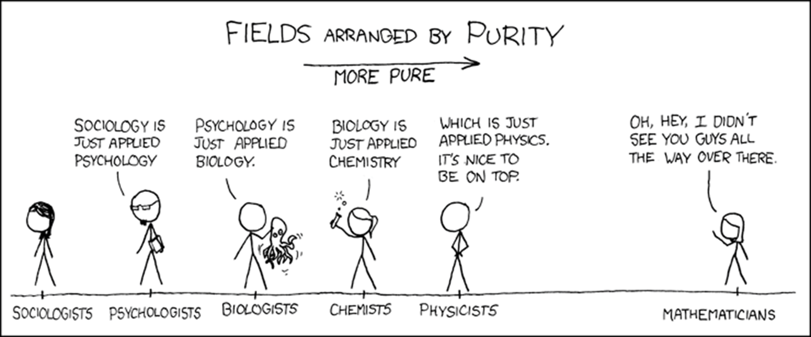
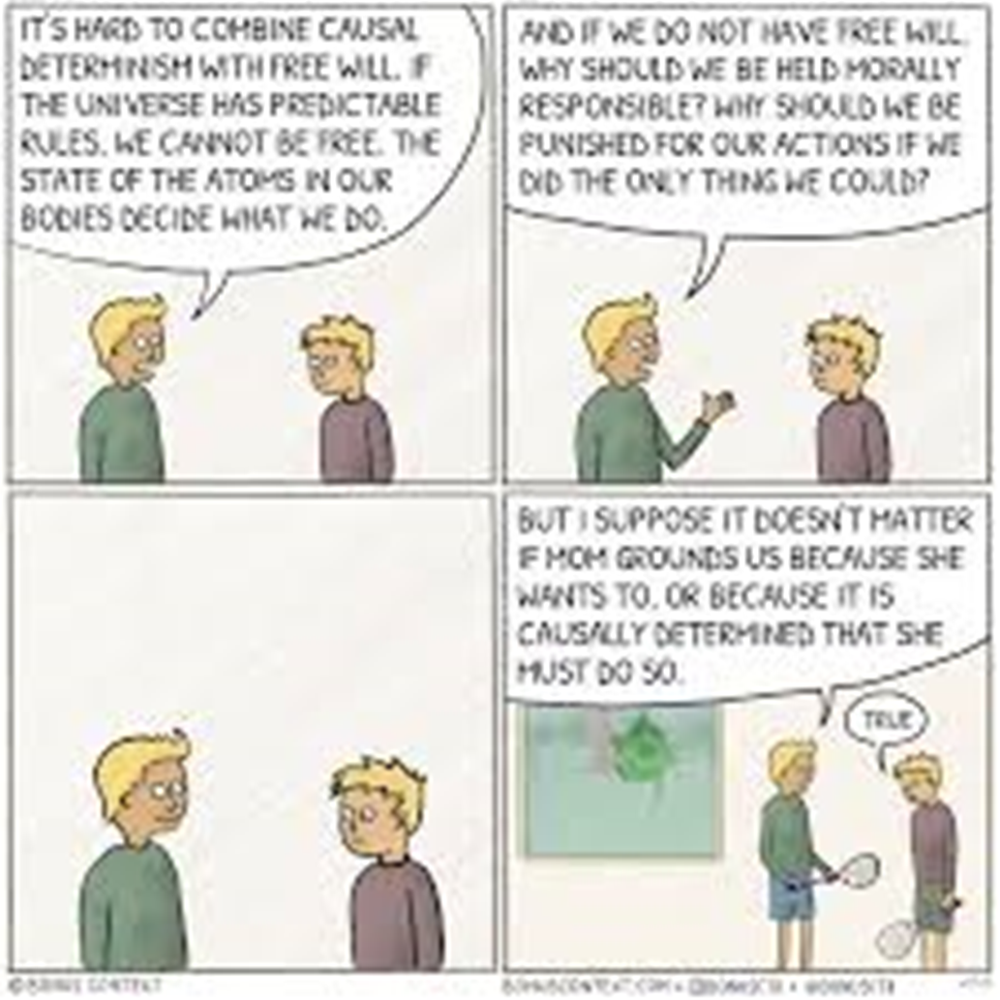

# Can Physics Predict the Future?

Imagine you’re in a courtroom. A defendant has been convicted of a knife crime during an attempted shoplifting at a local Tesco. 

His lawyer stands up and argues: *"Your Honor, you cannot convict him because it wasn't his fault. He was born in a rough neighborhood and was forced to shoplift to provide for his family. He was born there because his parents were refugees escaping conflict. That war was triggered by famine. The famine happened because of a drought caused by sunspot activity... So, basically, my client messed up because of the sun."*

This argument is blatantly nonsensical. You can’t keep extrapolating until you reach the origins of the universe... Or can you? If so, does free will really exist? 

This is the core of causal determinism: the idea that if it is possible to use physics to predict the future, then our entire lives are already mapped out. And if that's true, is there any point in doing anything?

---

## Laplace’s Demon
In the 18th century, the French scholar Pierre Simon Laplace published the first scientific articulation of causal determinism. 

Studying classical mechanics and Isaac Newton’s laws of motion, Laplace realized that if a "vast intelligence" existed, one that knew the positions and motions of every particle in the universe at a single moment, it would also know the entire future. 

### Why Classical Mechanics?
The beauty of classical physics is that if you know the initial conditions and the laws of physics, you know exactly what happens next. 

> **Example:** To find the distance traveled by a baseball, we calculate the force exerted by the batter, air resistance (modeled as a quadratic), and even how backspin creates lift. 

Using these equations, Laplace’s Demon could predict the future of every particle, and therefore, theoretically, every person.

---

## The Hierarchy of Abstraction: From Physics to Semantics
It sounds kind of strange that knowing a particle's position could predict a person's life. To bridge that gap, we can use a "building by abstraction" hierarchy, where each layer filters out the "noise" of the layer below.

1.  **Physics:** We track the position and momentum of every quantum particle.

2.  **Chemistry:** We map the movement of electrons to identify atoms and molecules. We use **Schrödinger’s Equation** to describe the evolution of a quantum system:
    $$i\hbar \frac{\partial}{\partial t} \Psi(\mathbf{r},t) = \hat{H} \Psi(\mathbf{r},t)$$

3.  **Biology:** These molecules form lipids, nucleic acids, and eventually organ systems. Neurons use sodium and potassium ions to generate electrical signals.

4.  **Neuroscience:** We map the brain as a graph, with neurons as nodes and synapses as edges/weights.

5.  **Cognitive Level:** We identify functional clusters (e.g., the left frontal lobe for verbal cognition). We encode neural patterns onto abstract variables like goals and perceptions.

6.  **Sociology:** We use mental states and environmental settings to model behavior using **Game Theory**.

### A Game Theory Example: The Prisoner's Dilemma
Two suspects are arrested and held in separate cells. They are offered a deal:
* **One confesses, one stays silent:** Confessor goes free (0 years); silent one gets 20 years.
* **Both stay silent:** Both get 1 year.
* **Both confess:** Both get 5 years.

Mathematically, the "dominant strategy" for an individual is to confess. Because both players act rationally for themselves, they both end up with 5 years, even though staying silent would have been better for the pair. This shows how we can predict choice through logic, which inherently removes the concept of choice in itself.

---

## The Challenges

### 1. Quantum Uncertainty
Heisenberg's Uncertainty Principle states you cannot know both the position and momentum of a particle simultaneously. Without those initial inputs, the Demon's model fails at step one. Read more about that here -> 

### 2. Scale and Complexity
The human body contains roughly $6 \times 10^{27}$ atoms. 

* To store the position and momentum of each atom (3D space), you need 6 real numbers per atom.

* At 8 bytes per number, you would need $2.88 \times 10^{29}$ bytes.

* That is **288,000 Yottabytes (YB)**. 

The current world storage capacity is between 0.01 and 0.2 YB. We would need millions of times the world's current storage just for **one human**.

### 3. The Butterfly Effect
If a butterfly flaps its wings in central park in New York, it could start a tornado in Texas.

Meteorologist Edward Lorenz discovered that in complex systems (like weather), rounding a decimal from `.506127` to `.506` changed the entire outcome. This is **Chaos Theory**.

A simplified model of the atmosphere produces the **Lorenz Attractor** (the butterfly graph). The system follows exact equations, but the path is so sensitive to initial conditions that long-term prediction requires **infinite precision**.

---

## The Final Verdict
Okay, so let’s pretend LaPlace’s demon did exist...(it doesn’t).
Then yes, technically you could predict the future.
But also…

1. The demon’s knowledge is just a simulation of the universe, so it would have to be at least as complex as the universe itself.

2. This means it would need more matter than what the universe currently holds in order to compute the state of the universe at a faster rate than the actual progression of the universe.

3. Even if it uses the universe itself as a computer it is unable to compute the future fast enough.

4. So the only way for the demon to exist is for it to be **the universe itself**. 

5. But if this is the case, we run into the  **self reference paradox** in which if something attempts to predict what it in itself is going to do, the act of attempting to predict its own system will change its own future.

**In Summary**: Free will effectively exists, and even if it didn't, it doesn't really matter...

