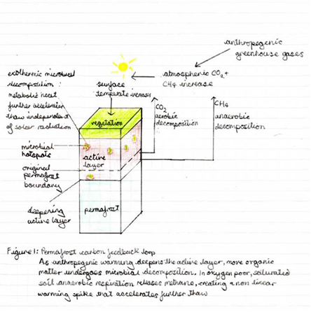

# "What are climate tipping points, and how likely is it that humans might trigger them?”
### _Written by a friend of Maramureş_
A tipping point in most contexts is referred to as “a critical threshold beyond which a system reorganises, often abruptly and/or irreversibly”. (IPCC, 2023) Specifically, within climate science, tipping points refer to parts of the earth’s system where a small change can trigger a positive feedback loop that changes the system from one state into another. (Met Office, 2023) Climate tipping points challenge the linear model of climate change instead suggesting a non – linear model where global temperatures could rapidly increase after certain “tipping points”. This model suggests global warming would intensify due to positive feedback loops rather than a gradual temperature increase over time. (Formanski et al., 2022) Recently, research has highlighted the dangers of rate-induced tipping points. This puts particular emphasis on the rate of change and its impact on an ecosystem’s stability. (Feudel, 2023) These tipping points make the human causation of climate change harder to judge. Instead, when these tipping points are breached, the ecosystem becomes unstable, so it starts changing rapidly. Under this model, these processes can continue even if human emissions stop increasing. (Nebriefing.org, 2026) Therefore, human emissions are no longer proportional to the destruction caused on ecosystems. For example, individuals and companies’ actions are no longer proportional to their outcomes, making it increasingly difficult to resolve the damage. This disproportionate nature further increases the stakes of prevention. Climate tipping points change how human responsibility and causation must be understood instead of merely accelerating climate change. They also transform climate change from a problem of linear cause and effect into one where responsibility lies not only in total emissions but in the rate at which change is imposed.

Assessing the likelihood that humans might trigger tipping points is not as simple as trying to track gradual global warming. Predictions therefore involve inherent uncertainties in rates of change, threshold locations, and ecosystem sensitivity. This makes prediction far more difficult than under the linear cause-and-effect assumptions of traditional climate models. (Wunderling et al., 2024) Scientists and mathematicians understand that tipping points exist and are a serious cause for concern. However, the uncertainty that currently exists surrounding tipping points can cause the use of mathematical models to be limited, further increasing the risk that humans may trigger them without understanding the consequences. (Quanta Magazine, 2025)

Currently northern permafrost regions hold around 1,460-1,600 billion metric tons of organic carbon, almost double the volume of atmospheric carbon. (Schuur, 2019) Over thousands of years, cold temperatures have prevented the thawing and decomposition of this organic matter hence preventing it from releasing stored carbon into the atmosphere. (Global Carbon Budgets, n.d.) Anthropogenic warming heats the ground, thawing it out and therefore rapidly speeding up the rate of decomposition of soil carbon. Not only is carbon dioxide released into the atmosphere, but it also facilitates the anaerobic respiration of microbes, resulting in the release of methane. Methane is a far more potent greenhouse gas, its Global Warming Potential (GWP) is estimated to be 80 times that of carbon dioxide but this drops to approximately 26-38 times after 20 years as it gets oxidised in the air to carbon dioxide. (Sustainability Directory, 2025) This highlights a rate-induced danger, as methane release causes an intense temperature spike that can trigger further tipping points. Independent of human emissions, the exothermic nature of the microbial decomposition further thaws the surrounding permafrost which then promotes further thaw known as the “compost bomb effect”. (Figure 1 illustrates the “compost bomb” feedback loop.) The effect is particularly potent in vulnerable areas with drying, high porosity organic soils as the heat is unable to escape, resulting in a runaway effect where soil temperatures rise dramatically. (Wieczorek et al., 2010) Additionally, increased greenhouse gas concentrations in the atmosphere reinforce this feedback cycle. Permafrost thaw does not work in isolation, increased Arctic warming can weaken the Atlantic Meridional Overturning Circulation and accelerate boreal forest dieback, creating a cascade of tipping interactions. 

Research suggests that between 1.5 – 2 degrees of global temperature increase makes “widespread abrupt permafrost thaw” a likely climate tipping point. (Armstrong McKay et al., 2022) In all but one model tested by the IPCC, the planet is expected to exceed the 1.5 degrees threshold by 2030 and it is very likely that the Arctic will feel the effects more acutely than the rest of the planet. (IPCC, 2021) Therefore under current policies, triggering partial permafrost tipping points is highly likely, if not already underway. The transition of the Arctic from carbon sink to carbon source would represent a fundamental shift in the earth’s biogeochemical equilibrium. If the permafrost carbon feedback loop becomes fully engaged, the concept of a “Net Zero” target becomes harder to calculate. Furthermore, the net zero target may need to become net negative merely to stabilise the environment.

As the earth starts emitting greenhouse gases at a scale comparable to those of major nations, drastic and immediate policies must be implemented just to continue the same rate of global warming. (Global Carbon Budgets, n.d.) The focus therefore may need to be shifted from mitigation to urgent stabilisation as we fight the planet’s own feedback loops. If human warming breaches the 1.5 degrees threshold, as it is currently predicted to do, there is a large risk that an autonomous compost bomb is initiated where microbial heat sustains thawing independent of human activity. The likelihood of triggering tipping points is not merely theoretical but a direct consequence of human-driven rates of change. Subsequently, human intervention becomes partially dissociated from the eventual climatic outcome.

The precise timing and thresholds of climate tipping points remain uncertain, and this increases the risk that we may breach them. Many tipping points are sensitive to anthropogenic warming and increased emissions greatly increase the probability of crossing them. Early intervention is required to prevent triggering self-sustaining feedback loops instead of waiting for definitive evidence surrounding the nature of these tipping points. Consequently, humans are not only capable of triggering tipping points, but under current trajectories, are increasingly likely to do so.
  

---

---

Bibliography:

Armstrong McKay, D.I., Staal, A., Abrams, J.F., Winkelmann, R., Sakschewski, B., Loriani, S., Fetzer, I., Cornell, S.E., Rockström, J. and Lenton, T.M. (2022). Exceeding 1.5°C global warming could trigger multiple climate tipping points. Science, [online] 377(6611). doi: https://doi.org/10.1126/science.abn7950.

Feudel, U. (2023). Rate-induced tipping in ecosystems and climate: the role of unstable states, basin boundaries and transient dynamics. Nonlinear processes in geophysics, 30(4), pp.481–502. doi: https://doi.org/10.5194/npg-30-481-2023.

Formanski, F.J., Pein, M.M., Loschelder, D.D., Engler, J.-O., Husen, O. and Johann Martin Majer (2022). Tipping points ahead? How laypeople respond to linear versus nonlinear climate change predictions. 175(1-2). doi: https://doi.org/10.1007/s10584-022-03459-z.

Global Carbon Budgets. (n.d.). Available at: https://unfccc.int/sites/default/files/resource/Global_Carbon_Budgets_Current_and_Future_Permafrost_Emissions_as_Large_as_Major_Emitters_SusanaHancock.pdf.

IPCC (2021). Chapter 4. [online] Ipcc.ch. Available at: https://www.ipcc.ch/report/ar6/wg1/chapter/chapter-4/.

IPCC (2023). Sixth Assessment Report — IPCC. [online] Ipcc.ch. Available at: https://www.ipcc.ch/assessment-report/ar6/.

Met Office (2023). What do we mean by a climate tipping point? [online] Met Office. Available at: https://www.metoffice.gov.uk/blog/2023/what-do-we-mean-by-a-climate-tipping-point.

Nebriefing.org. (2026). National Emergency Briefing. [online] Available at: https://www.nebriefing.org/briefings/tipping-points

Quanta Magazine. (2025). The Math of Climate Change Tipping Points | Quanta Magazine. [online] Available at: https://www.quantamagazine.org/the-math-of-climate-change-tipping-points-20250915/.

Schuur, T. (2019). Permafrost and the Global Carbon Cycle – NOAA Arctic. [online] NOAA. Available at: https://arctic.noaa.gov/report-card/report-card-2019/permafrost-and-the-global-carbon-cycle/.

Sustainability Directory (2025). Why Is Methane Release from Permafrost More concerning than Carbon Dioxide? → Question. [online] Climate → Sustainability Directory. Available at: https://climate.sustainability-directory.com/question/why-is-methane-release-from-permafrost-more-concerning-than-carbon-dioxide/.

Wieczorek, S., Ashwin, P., Luke, C.M. and Cox, P.M. (2010). Excitability in ramped systems: the compost-bomb instability. Proceedings of the Royal Society A: Mathematical, Physical and Engineering Sciences, 467(2129), pp.1243–1269. doi: https://doi.org/10.1098/rspa.2010.0485.

Wunderling, N., von der Heydt, A.S., Aksenov, Y., Barker, S., Bastiaansen, R., Brovkin, V., Brunetti, M., Couplet, V., Kleinen, T., Lear, C.H., Lohmann, J., Roman-Cuesta, R.M., Sinet, S., Swingedouw, D., Winkelmann, R., Anand, P., Barichivich, J., Bathiany, S., Baudena, M. and Bruun, J.T. (2024). Climate tipping point interactions and cascades: a review. Earth System Dynamics, [online] 15(1), pp.41–74. doi: https://doi.org/10.5194/esd-15-41-2024.

