# Finding the diameter of a hair with quantum physics
### _By Mooshroom and Maramureş_
### An idea - what do you think would happen?
What would happen if you directed a particle - such as an electron or photon - at two slits?
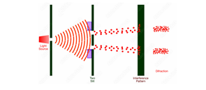

### What actually happens
You see an interference pattern with these fringes - which are these areas of high and low intensity. This is because electrons are **quantum objects.**

Quantum objects are very small objects that do not behave according to classical physics, but quantum mechanics.

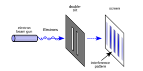

### Interference patterns
- The particle acts as a wave
- The objects, acting as waves, interact with each other, as shown below.
- Interference patterns - this means that there are areas of high and low intensity due to wave interactions

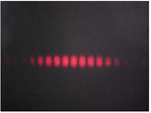

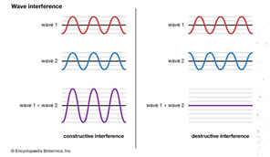
Image 1: Constructive and destructive waves

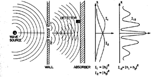
Image 2: Distribution of intensities showing fringes

### What if objects are sent one by one?

When quantum objects are sent through the two slits together, an interference pattern is created as the waves interact with each other. When they are sent one by one, the same interference pattern is created. This is because the particles are in a state of superposition (many states (wave/particle) or locations (either slit) at the same time). The particle goes through both slits simultaneously and interacts with itself.

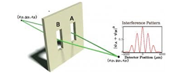

### The observer effect
What happens when a recording is taken (when a device is used to try and measure which slit the particle goes through)?
The **wavefunction collapses**: stops behaving like a wave, starts behaving like a localised particle. Takes a definite path (no superposition).
The measurement of the location causes the particle to behave like a discrete particle, only going through one slit.
This is because the act of measurement is not passive - it requires an interaction (e.g. sending out light).

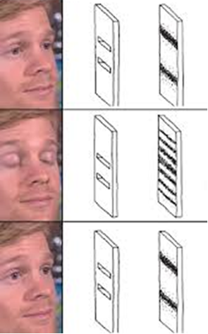
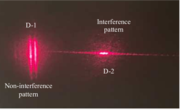

### Using this experiment to find the diameter of a hair

Here is the equation I used, along with its derivation:
<iframe width="560" height="315" src="https://www.youtube.com/embed/_uy6LsTBf84?si=t2lyknKKo0L-lW9f" title="YouTube video player" frameborder="0" allow="accelerometer; autoplay; clipboard-write; encrypted-media; gyroscope; picture-in-picture; web-share" referrerpolicy="strict-origin-when-cross-origin" allowfullscreen></iframe>
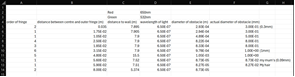

### WHAT IS THIS DARK MAGIC ??
i.e. what is the observer effect and why does it exist?

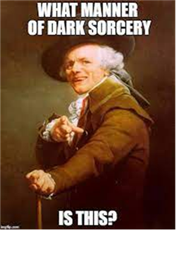

#### Well actually... it's just maths

- Something called the **uncertainty principle**
- The more you know about the **position** of a quantum particle, the less you know about its **momentum** and vice versa
- When we don't observe the slits, we know nothing about the position, giving us that lovely superposition interference pattern which is just a lovely spread of predictable momenta of the wave. (since **momentum is inversely proportional to wavelength**)
- So when we do observe the slits, we gain info about the particle's position, so now we know less about the momentum, giving us those two blobs, like classic particles.

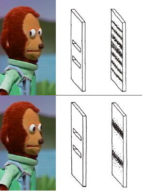

### Uncertainty principle
σx ⋅ σp ≥ ħ/2

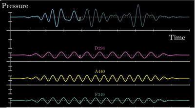

//gif1

//gif2

### De Broglie Equation
Calculates the wavelength of any moving object

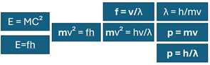

### Thanks for reading!

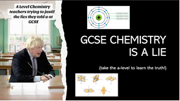

