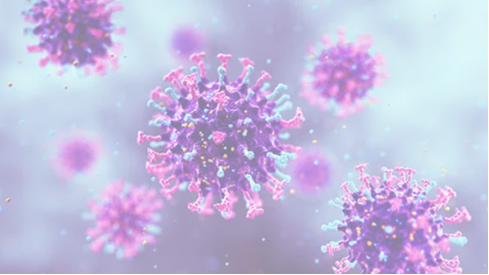
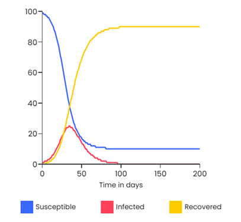
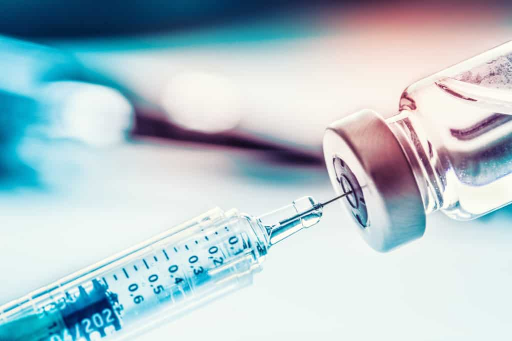

# Epidemic Modelling
### _By Wagyu_

## The SIR Model
**S → I → R**

* **S(t)**: number of susceptible individuals
* **I(t)**: number of infected individuals
* **R(t)**: number of recovered individuals
* **$\beta$**: infection rate
* **$\gamma$**: recovery rate

$$S(t) + I(t) + R(t) = N$$

---

### Assumptions
* Fixed population
* The only way to leave S is to become infected, the only way to leave I is to recover
* Age, gender etc do not affect probability of being infected
* No inherited immunity
* Rate of increase in I is proportional to contact between S and I
* Recovery rate is constant
* Constant parameters

---

### Mathematical Framework
$$\frac{dS}{dt} = -\beta SI$$
$$\frac{dI}{dt} = \beta SI - \gamma I$$
$$\frac{dR}{dt} = \gamma I$$

**Basic Reproduction Number ($R_0$):**
$$R_0 = \frac{\beta}{\gamma}$$

* The average number of secondary infections caused by one infected individual
* **$R_0 < 1$**: infection dies out
* **$R_0 > 1$**: epidemic grows
* **$R_0 = 1$**: stable disease spread

---

### Example

**Initial Conditions & Parameters:**
* $N = 100$
* $S_0 = 99$
* $I_0 = 1$
* $\beta = 0.3$
* $\gamma = 0.1$
* $R_0 = 2.5$

**Calculations:**
* $\frac{dS}{dt} = -\beta SI = \frac{-0.3 \times 99 \times 1}{100} = -0.297$
* $\frac{dI}{dt} = \beta SI - \gamma I = 0.297 - (0.1 \times 1) = 0.197$
* $\frac{dR}{dt} = \gamma I = 0.1 \times 1 = 0.1$

> **Dependence on S:** More susceptibles → more people available to infect. As long as S is large, infection can spread easily.
>
> **Dependence on I:** More infected → more infectious contacts. Each additional infected individual increases the total infection pressure.

---

### Variations: The SEIR Model
**S → E → I → R**

* **$\sigma$**: rate at which exposed individuals become infectious

$$\frac{dS}{dt} = -\beta SI$$
$$\frac{dE}{dt} = \beta SI - \sigma E$$
$$\frac{dI}{dt} = \sigma E - \gamma I$$
$$\frac{dR}{dt} = \gamma I$$

---

### Herd Immunity + Vaccinations

Vaccinations move individuals directly from the Susceptible (S) class to the Recovered (R) class, bypassing the Infected.

* **Effective Reproduction Number ($R_{eff}$):** The number of people in a population who can be infected by an individual at any specific time. Vaccination reduces this number.
* **Herd Immunity:** Occurs when not enough people are susceptible so $R_{eff} < 1$, causing the disease to die out.

**The Herd Immunity Threshold (HIT):**
This is the critical proportion of the population that must be immune to stop an epidemic, defined as:
$$HIT = 1 - \frac{1}{R_0}$$