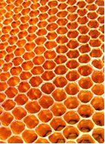
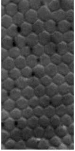
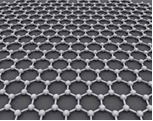
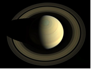
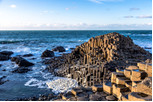
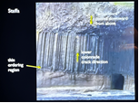
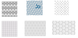
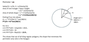
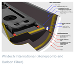
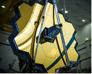

# Why is everything a hexagon?
### _By Angus_
### Have you ever wondered why hexagons seem to always appear in nature?

#### Honeycomb
Honeycomb is made of **beeswax walls** and **stores honey.**
- According to the British Beekeeper’s Association, for bees to make 1kg of beeswax, they must use 6kgs of honey, which is equivalent to 66 million flowers.
Since it is **so much harder to make beeswax than honey**, the most efficient way of storing honey is by using the **minimum** amount of beeswax that can store the **maximum** amount of honey. The most efficient shape for this is the circle (as it **maximises area for the minimum perimeter**).
- Bees mould the bare honeycomb into **cylindrical shapes** as they build each circle around their body, before heating the wax, causing it to **melt** slightly.
- Since circles lack the tiling property of other shapes, the melted wax moves into the most **energy-efficient** shape, which is a hexagon.
(Bees may _not_ actually be nature's best engineers...)

#### Retina cells
Cross section of human retina:

This hexagonal pattern is called a **retinal mosaic.**
The cells are in this pattern as this is also the most efficient pattern, as the arrangement allows the **most light to be detected** by the light-sensing cells.
Also, there are **no gaps** between cells.
More light detected, less gaps and higher density of retinal cells leads to sharper vision.
Cells are often hexagonal due to the shape's **energy efficiency** and **tiling ability**, and this is seen in many parts of the body and in many other animals, for example the skin cells of most reptiles!

#### The concept of shapes adapting to require the least perimeter for the greatest area  - bubbles
(or the least surface area for the greatest volume)
In nature, the most energy-efficient structures are most common as they are the **most likely to form.**
A cool video that I found that illustrates this idea well:
<iframe width="560" height="315" src="https://www.youtube.com/embed/GKvT1lRWhE0?si=zf81q-0wUjTK3Vb7" title="YouTube video player" frameborder="0" allow="accelerometer; autoplay; clipboard-write; encrypted-media; gyroscope; picture-in-picture; web-share" referrerpolicy="strict-origin-when-cross-origin" allowfullscreen></iframe>

#### Graphene (the strongest material in the world
- Graphene is **10x** stronger than steel in terms of absorbing kinetic energy and **200x** stronger than steel under tensile stress, under an equal weight basis.
- Graphene has the **highest tensile strength of all materials** due to strong covalent bonds and its hexagonal shape, which evenly distributes stress. Hexagonal lattices distribute compressive stress better than squares, and can also better withstand shear stress (stress parallel to the surface), as squares have the weakness of a 90 degree angle.
- The hexagonal structure comes from the 120 degree angle between each of the 3 sp2 hybrid orbitals (mix of one s orbital and 2 p orbitals) holding 3 of each atom’s valence electrons. The overlap of the orbitals forms **strong covalent bonds.**

#### The Great Hexagon of Saturn
- A **polar vortex** is a low pressure system of cold winds that circulate around a planet’s poles.
- On **Saturn**, there is a polar vortex around its north pole.
- It is 30,000 km across and spins at around 500km/h
- There have been theories to do with interactions of jet streams and air currents in the atmosphere that form a **stable hexagonal shape**, but nothing has been proven yet and the reason behind the hexagon is a **mystery** (as of 2025).

#### Basalt lava columns
- 60 million years ago, volcanic eruptions in Northern Ireland let out many layers of lava. The lava columns there are called **Giant's Causeway**.
- The lava cooled from **top to bottom**. This is because the surface is exposed to air, allowing energy to be lost quickly due to **heat conduction**. Deeper inside the rock, cooling is mostly due to water, causing heat loss through **convection**. At the bottom, the basalt is next to the ground, causing temperature to decrease very slowly. Due to the **different rates of cooling throughout the material**, the cracks advanced downwards and the rock fractured into a hexagonal pattern. This is called **columnar jointing**. Cracks are formed in a hexagonal shape as this relieves the most stress inside the material through the fewest number of fractures (most energy efficient).
- At the top, the hexagons are smaller as the faster rate of cooling means **stresses develop more quickly** in the rock, and are relieved through **more small fractures**, whereas at the bottom, the lower rate of cooling allows **stresses to slowly build up and be released in large increments**, resulting in larger hexagons.

### Tiling
Tiling efficiency is another reason why hexagons occur more in nature than other shapes.

Take a **n-sided** regular shape with **side length s** and fit it inside of a circle.

### How has this pattern been used?
- Hexagons are commonly used in aerospace engineering due to their **tiling efficiency**, **strength** (contributes to ability to withstand a lot of stress and dissipate energy) and **low perimeter to area ratio**, which can help with efficiency in materials and provide insulation.
- An example of this is honeycomb materials in the walls and wings of planes.
- The primary mirror of the **James Webb Space telescope** is made of hexagonal tiles, using the hexagon’s ability to tesselate without gaps to **maximise light collected** by the telescope. The shape also allows the mirror to be easily folded.
- Modern rowing shells are made of carbon-fibre reinforced plastic in a honeycomb structure. This structure is used as it is lightweight (low perimeter to area ratio) and strong as it is good at dissipating energy.

