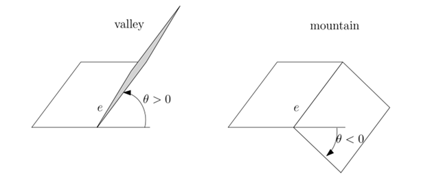
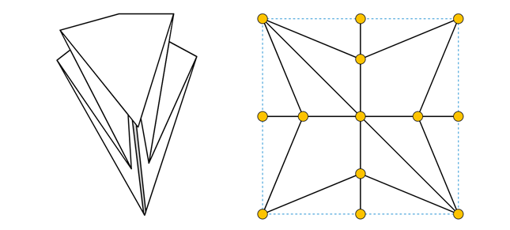
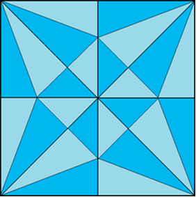
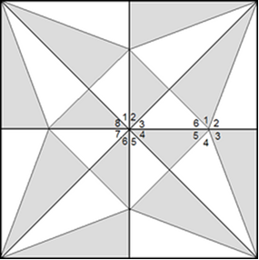
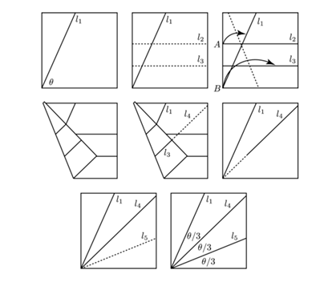
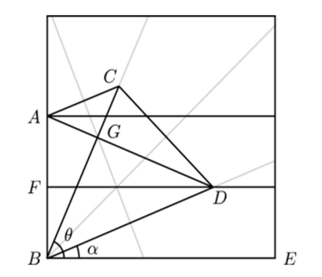
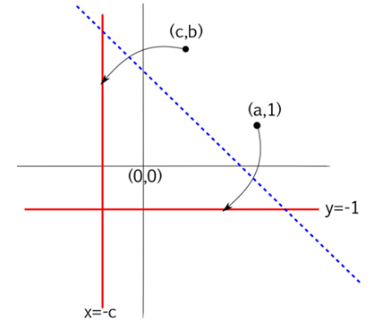

# Origami: The Geometry of Folding
### _By Wagyu_

### Core Definitions
* **Every fold is a line**
* **Every intersection is a vertex**

---

## Fundamentals of Flat-Foldability
* **Two types of fold:** Mountain folds and valley folds.
* **Flat-foldable origami model:** A design that can be completely compressed into a single, two-dimensional plane without tearing the paper or creating new creases.
* **Reflection:** Paper layers are reflected across crease lines.
* **Overlapping:** When there is a fold, the paper forms multiple overlapping layers.
* **Layering:** Each layer is a physical copy of a region of paper above/below it.
    * *Mountain folds* put layers behind.
    * *Valley folds* bring layers forward.

---

## Mathematical Foundations

### Planar Graphs and Euler’s Formula

Origami crease patterns are essentially planar graphs. A planar graph is a graph in the plane that can be drawn such that its edges intersect only at their endpoints. 

**Euler's Formula** states that if a finite, connected planar graph is drawn in the plane without any edge intersections:
* $v - e + f = 2$
* Important for crease pattern validity.

---

### Maekawa's Theorem

Maekawa's Theorem dictates the relationship between the types of folds at a vertex:
* $M - V = 2$
* $M - V = -2$
* The difference between mountain folds and valley folds is **always 2**.
* This implies that the total number of creases must be **even**.
* Therefore, the regions between the creases can also be colored with **two colors**.
* **Layer Balance:** When paper folds flat, layers must stack alternately; each fold changes the direction of the paper surface. The $\pm 2$ difference balances the layers to test if designs are physically foldable.

---

### Kawasaki's Theorem

Describes the crease patterns with a **single vertex** that may be folded to form a flat figure. It states that the pattern is flat-foldable if and only if alternatingly adding and subtracting the angles of consecutive folds around the vertex gives an alternating sum of zero.

---

## Huzita-Hatori Axioms
These axioms define the operations possible in origami geometry:

1.  Given two distinct points $p_1$ and $p_2$, there is a unique fold that passes through both of them.
2.  Given two distinct points $p_1$ and $p_2$, there is a unique fold that places $p_1$ onto $p_2$.
3.  Given two lines $l_1$ and $l_2$, there is a fold that places $l_1$ onto $l_2$.
4.  Given a point $p_1$ and a line $l_1$, there is a unique fold perpendicular to $l_1$ that passes through point $p_1$.
5.  Given two points $p_1$ and $p_2$ and a line $l_1$, there is a fold that places $p_1$ onto $l_1$ and passes through $p_2$.
6.  Given two points $p_1$ and $p_2$ and two lines $l_1$ and $l_2$, there is a fold that places $p_1$ onto $l_1$ and $p_2$ onto $l_2$.
7.  Given one point $p$ and two lines $l_1$ and $l_2$, there is a fold that places $p$ onto $l_1$ and is perpendicular to $l_2$.

---

## Geometric Constructions

### Trisecting an Angle
 

Using origami to trisect an angle $\theta$:
* $BE$ and $DF$ are parallel so $\angle DBE = \angle BDF$.
* Since $DF$ is the height of the isosceles triangle $ABD$, $\angle BDF = \angle ADF$.
* $\alpha = \angle DBE = \angle BDF = \angle ADF$. 
* $ABDC$ is an isosceles trapezium and $ABD$ is an isosceles triangle, so $ABD$ and $CBD$ are congruent isosceles triangles.
* $\angle CBD = \angle ADB = \angle BDF + \angle ADF$. 
* $\theta = \angle CBE = \angle DBE + \angle CBD = \angle DBE + \angle BDF + \angle ADF = 3\alpha$.

---

### Solving Equations (Cubic)

Origami can be used to solve a cubic equation: $x^3 + ax^2 + bx + c = 0$.
* Points: $p_1 = (a, 1)$ and $p_2 = (c, b)$.
* Lines: $L_1 = \{y = -1\}$ and $L_2 = \{x = -c\}$.
* Action: Fold $p_1$ to line $L_1$ and $p_2$ to line $L_2$ and create a new crease line. 
* **The slope of the crease line is a root** to $x^3 + ax^2 + bx + c = 0$.
* A cubic has either 3 real roots, 1 real and two complex, or one real and two repeated.
* Origami only gives the **real solutions**.

---

## Applications
* **Space engineering**
* **Medical devices**
* **Safety devices**
* **Architecture + engineering**
* **Robotics**
* **Material science + nanotechnology**