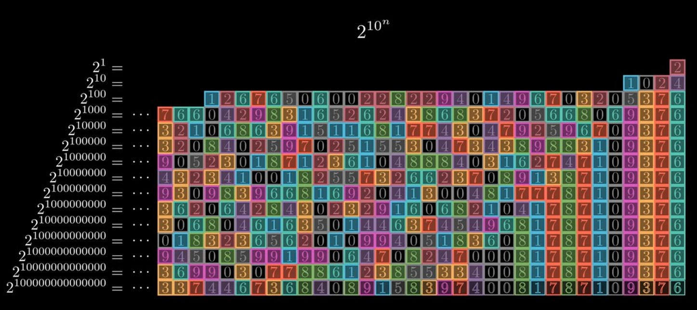
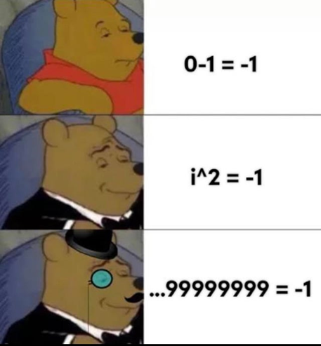
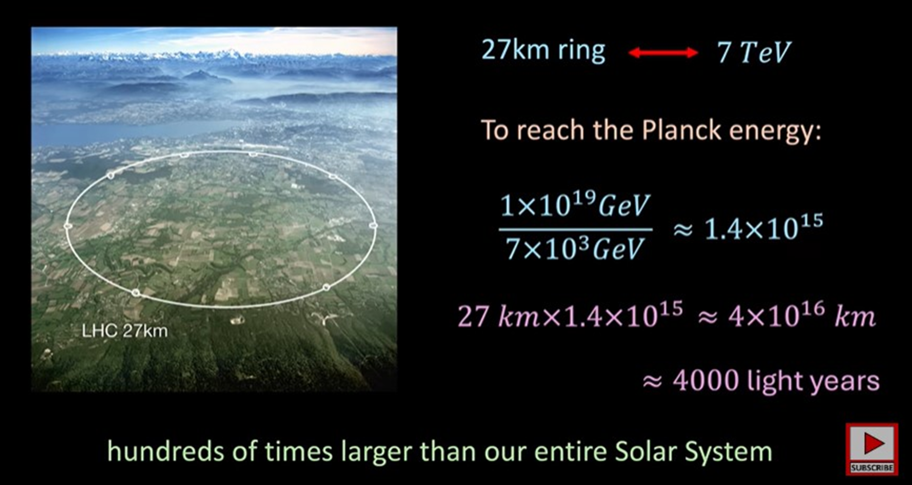
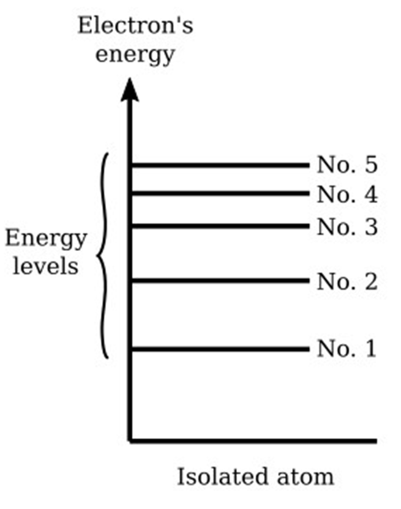

# Physics x Number Theory
### _By Maramureş_

Carl Friedrich Gauss (the legend who calculated the sum of 1 to 100 instantly) called number theory the **Queen of Mathematics**. It is basically the study of integers and the hidden properties, patterns, and relationships between them. It has a very heavy focus on prime numbers, as these have only 2 factors. Number theorists spend their time trying to find primes or spot patterns to figure out where they might be hiding, and often, they show up in some pretty wacky places!

## Nature’s Prime Timing
For example, for six weeks every 13 or 17 years, cicadas emerge from underground to mate. Because 13 and 17 are both indivisible, this gives the cicadas an evolutionary advantage in avoiding other animals with periodic behavior. 

> **The Logic:** Suppose a predator appears every six years in the forest. A cicada with an eight or nine-year life cycle will coincide with that predator much more often than a cicada with a seven-year prime life cycle.

## The Unsolved and the Encrypted
Number theory often deals with simple-to-state problems which require really sophisticated math to solve. Some famous examples include:
* **Goldbach’s Conjecture:** Can every even number be written as the sum of two primes?
* **Twin Prime Conjecture:** Are there infinitely many prime numbers which are two apart?

Outside of pure theory, one of the main non-physics uses of primes is in **Data Encryption**:
* **Key Generation:** Two large prime numbers are chosen and combined to create a public key (shared) and a private key (kept secret).
* **Encryption:** A sender uses the recipient's public key to turn a message into unreadable ciphertext.
* **Decryption:** Only the recipient's private key can unlock the ciphertext and convert it back into the original message.
* There is no easy way (as of yet) to factorize a huge number to find these two primes, so for now, our data is safe!

---

## Defining a New Universe: The P-adics
Okay, so what exactly am I talking about? Let's have a look at the powers of 2. If we look specifically at $2^{10^n}$ for some positive integer $n$, as n gets larger, the powers of 2 seem to be converging towards something...
This seems counterintuitive because we know from the real number system that power of 2 diverge towards infinity... so have we discovered the secret digits of infinity? Not quite. In fact, we've just stumbled across a new number system, they're not the real numbers, not the complex numbers, but somthing else entirely.

In this system, as we keep going with powers of 10, a larger and larger proportion of the digits become 0. As $n$ tends towards infinity, $10^n$ seems to be approaching 0, making it a very small number indeed, completely warping our idea of what size really is.

This is the p-adic system.

### The Rules of the P-adic World
In the real number world, an absolute value is how far a number is from 0 on the number line. In the p-adic system, we define a new version of absolute value:

1. **P-adic Valuation ($v_p(a)$):** A function that returns the highest power of $p$ that a number, $a$, divides.
   * *Example:* The 5-adic valuation of 425 is 2, as the highest power of 5 that divides it is $5^2$ (25).

2. **P-adic Absolute Value ($|a|_p$):** This is defined as $p^{-v_p(a)}$. A number is "small" if it is divisible by a high power of $p$.
   * *Example:* The 5-adic valuation of 425 is 2 (since $5^2$ is the highest power). 
   * The absolute value is $|425|_5 = 5^{-2} = 1/25$ (or $0.04$).
   * Compare this to $|2|_5 = 5^0 = 1$. 

**This means in the 5-adic system, $2 > 425$!** A number is smaller if it divides a higher power of $p$.

### Subverting our ideas of large and small...
In the 10-adic system, if you add 1 to $...999999999999$ you get an infinite number of 0s, which is just 0. Therefore, $...999999$ is equal to $-1$! 

If that feels counterintuitive, have a look at the algebra:

> Let $x = ...999$
>
> Then $10x = ...990$
> 
> $x - 10x = (...999) - (...990)$
>
> $-9x = 9$
>
> $x = -1$

While our usual ideas of small and large are tied to real numbers, in this world, 10 billion becomes very tiny indeed.

---

## Why Do We Care? The Planck Scale Problem
A **sub-Planckian scale** refers to distances smaller than the fundamental Planck length ($1.6 \times 10^{-35}$ m), which is about a billion billion times smaller than an electron. At this scale, our current understanding of gravity and quantum mechanics breaks down and quantum gravity effects become dominant.
In a similar way to how when you travel near the speed of light newtonian mechanics breaks down and one has to shift to Einstein's theory of general relativity, at such a small scale, quantum theory and general relativity begin to contradict each other and so something else is needed...

### Why Real Numbers Fail
Real numbers are ‘Archimedean’, meaning you can always reach a larger number by adding smaller numbers together. However, at sub-Planckian scales this logic may not apply:
* **The Micro-Black Hole:** According to the Heisenberg uncertainty principle, higher precision requires higher energy. If you attempt to measure a distance smaller than the Planck length, you concentrate so much energy into a small volume that you create a micro-black hole. 
* **The Event Horizon:** The region you are trying to measure is hidden behind an event horizon, meaning you cannot physically reach those distances. The real number coordinate system becomes meaningless.

### The P-adic Solution
In the p-adic system, space is more discrete. It uses a **tree structure** where distance is determined by how far back you have to go to find a common branching point. 
* In p-adic integers, **16 and 1024 are a lot closer than 16 and 17!**
* Some physicists believe that at this tiny scale, space follows an **ultrametric geometry**, where all triangles are isosceles and every point inside a circle is its center.
* This kind of geometry relies on the 'hierarchical' nature of the p-adic system, the distance between two points is determined by how far back you have to go to find their common branching point.

---

## The Reality Check: Particle Accelerators
Quite trivially, in order to see something we require three different things: some kind of light to see it with, the object itself, and something to observe it with.
To see something small, we need light (or particles) with a wavelength roughly the same size or smaller than the object. However, the shorter the wavelength of light, the more energy these photons have. This is due to the direct proportionality between energy and frequency: E = hf.

| Accelerator / Scale | Energy / Potential Difference | Capability |
| :--- | :--- | :--- |
| **Large Hadron Collider (CERN)** | 13.6 Tera eV (Trillion Volts) | Sees things 100 million times smaller than an atom (Higgs Boson). |
| **The Planck Length ($1.6 \times 10^{-35}$ m)** | $1.99 \times 10^{29}$ V | Requires a circuit **1.46 x 10^16 times larger** than our current capabilities. |

**The Bottom Line:** As we focus huge amounts of energy on smaller regions, the surrounding ‘spacetime’ (the 4D fabric of the universe) starts to warp and collapse under its own gravity. This is because concentrating huge amounts of energy on smaller and smaller regions results in the gravitational effect of that energy becoming significant. At some point the energy is so large that it collapses under its own gravity to form a black hole.
Until we can solve the black hole problem, the "Queen of Mathematics" might be our best way to peer into the sub-Planckian world.

---

### The Heisenberg Conflict
Our good old friend **Heisenberg** was frustrated that classical physics did not give the right idea of things. He was angry that theorists described electrons orbiting an atom like the earth orbiting the sun, despite us not knowing their position or momentum. 

He attempted to formulate theory purely based on observables: the **transitions of electrons** from one discrete energy level to another. This caused a shift from calculus (calculating change) to the **algebra of matrices**, which is extremely number theoretic.
He decided to assign quantities to each pair of energy states and wrote equations to help relate the different pairs to each other, this is known as **matrix mechanics**.

This aligns perfectly with p-adic geometry. In a p-adic "tree" space, you don't move continuously from point A to point B. Instead, the space is **totally disconnected**. To get from one "leaf" to another, you must jump through a common branching point. This "jumpy" nature of p-adic numbers might be the exact mathematical language needed to describe how an electron moves between energy levels without existing in the space between them.

